# SIAMP - Sistema Integrado de Apontamento, Machine Learning e Gestão de Produção

Plataforma para digitalização e automação do processo de fechamento de turno no setor de Injeção Plástica, eliminando registros em papel e integrando dados operacionais a dashboards analíticos e ao acompanhamento de Ordens de Produção.

## 📸 Capturas de Tela

**Login → Início**

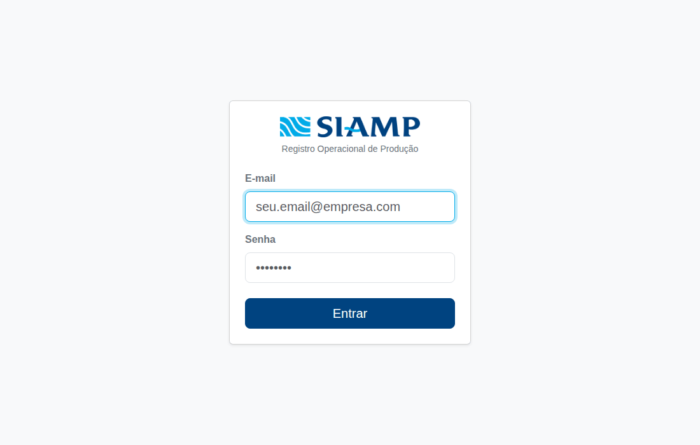

**Apontamento por lançamento** — peça, quantidade e horário livre (início/fim), sem grade fixa por hora:

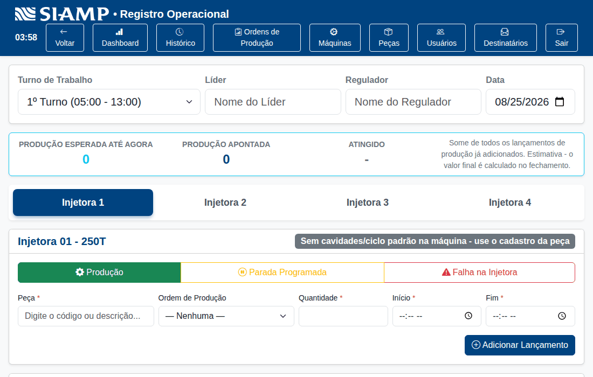

<table>
<tr>
<td>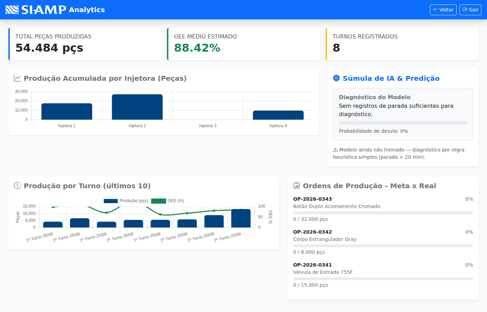</td>
<td>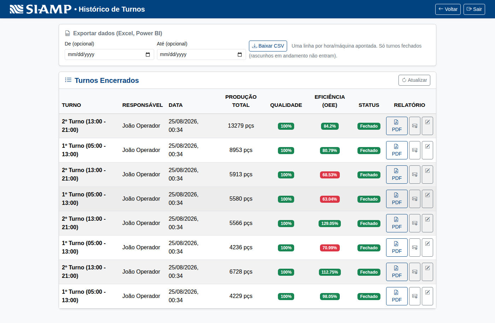</td>
</tr>
<tr>
<td align="center"><sub>Dashboard Analítico</sub></td>
<td align="center"><sub>Histórico de Turnos, com exportação CSV</sub></td>
</tr>
<tr>
<td>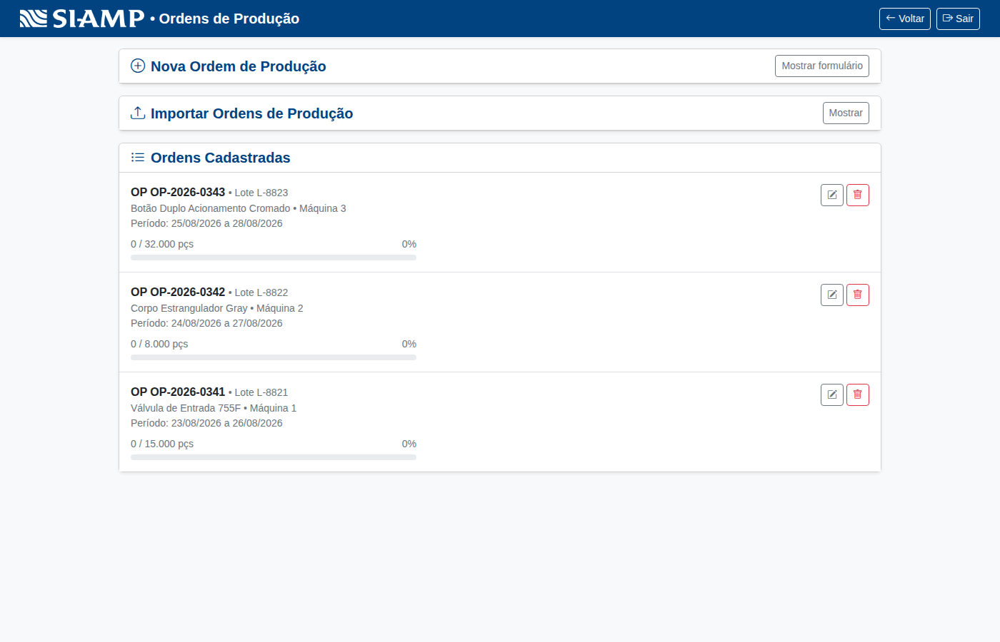</td>
<td>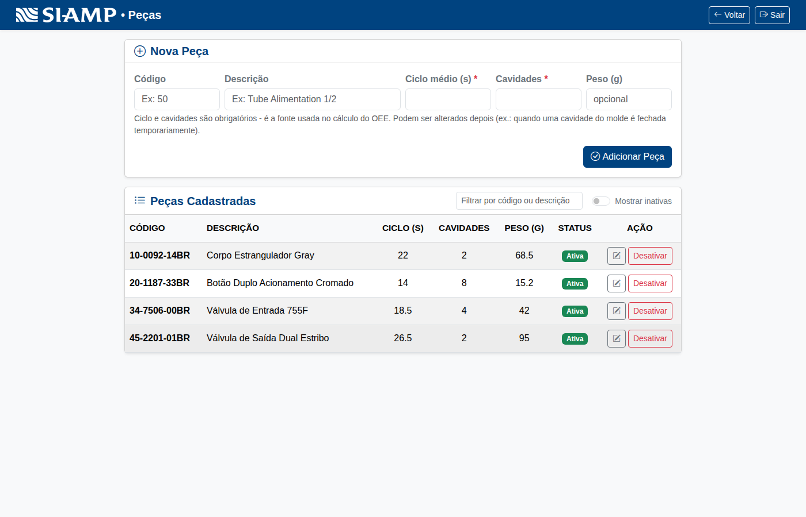</td>
</tr>
<tr>
<td align="center"><sub>Ordens de Produção, com importação CSV/XML</sub></td>
<td align="center"><sub>Catálogo de Peças</sub></td>
</tr>
<tr>
<td>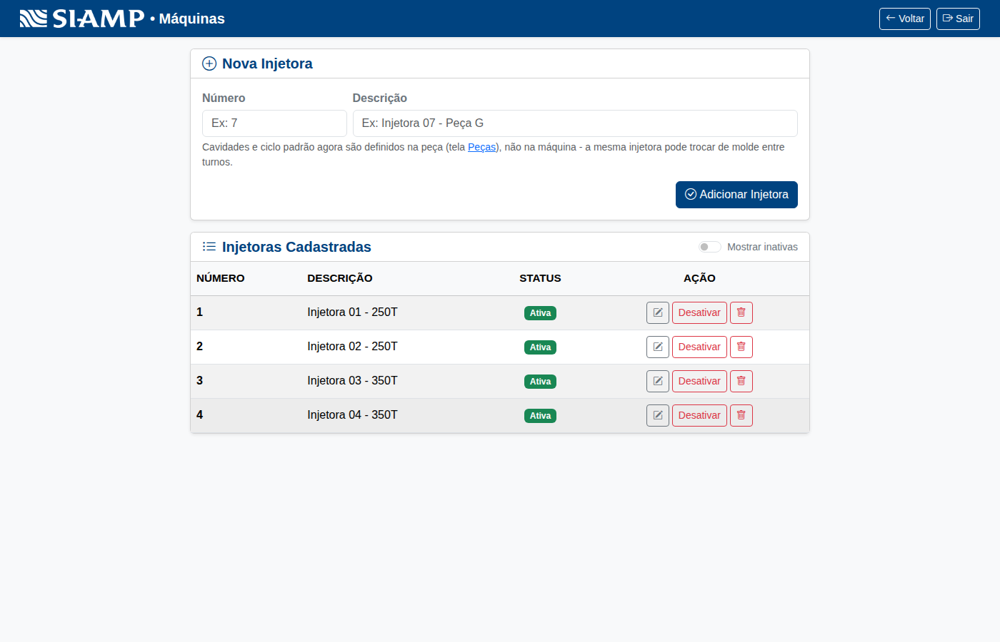</td>
<td>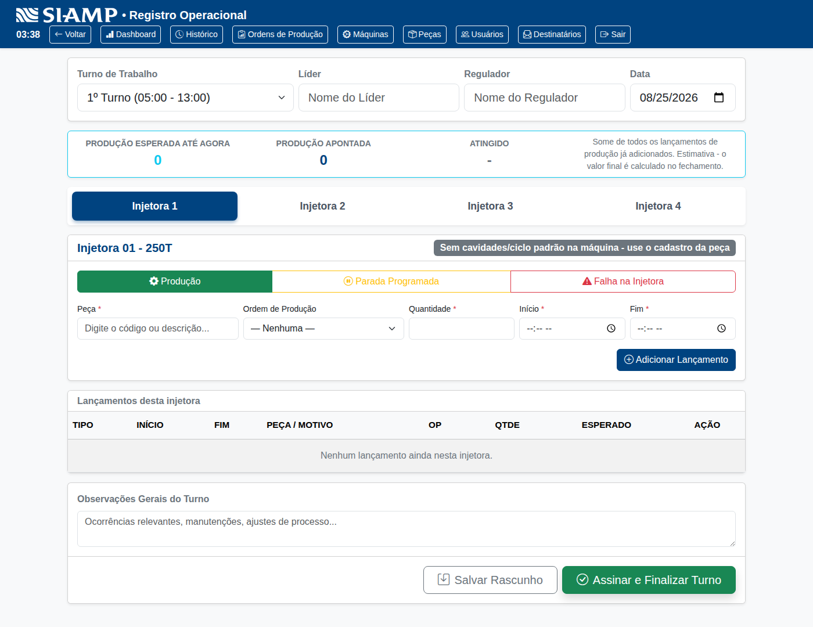</td>
</tr>
<tr>
<td align="center"><sub>Máquinas</sub></td>
<td align="center"><sub>Apontamento por lançamento (produção/parada, horário livre)</sub></td>
</tr>
<tr>
<td>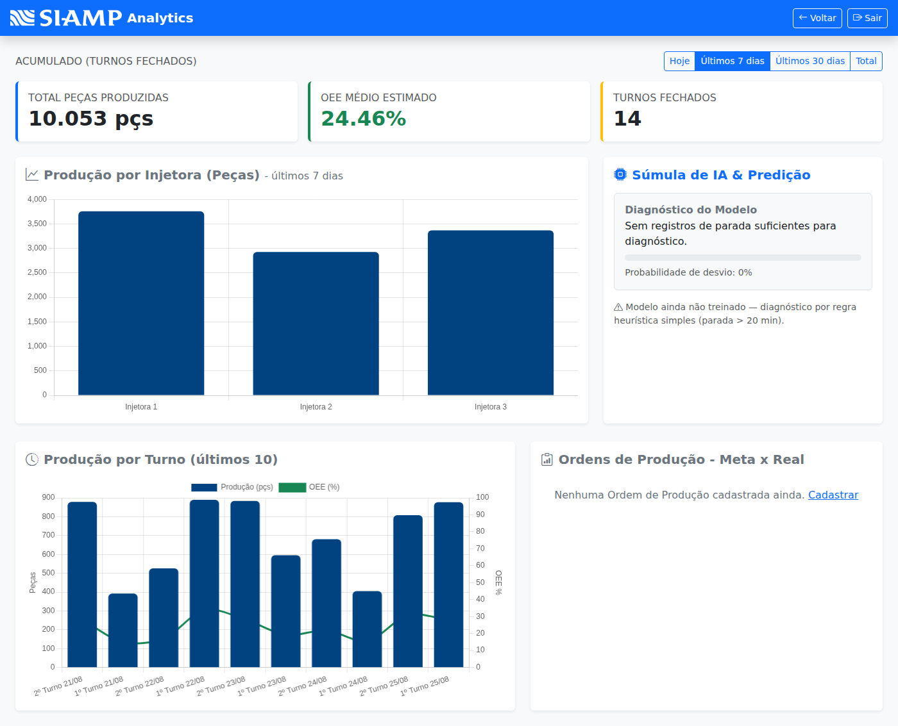</td>
<td>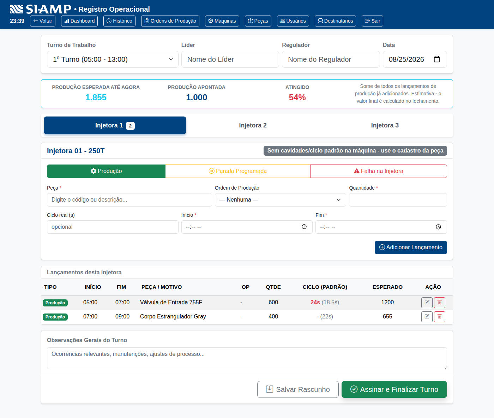</td>
</tr>
<tr>
<td align="center"><sub>Dashboard filtrado por período (Hoje / 7 dias / 30 dias / Total)</sub></td>
<td align="center"><sub>Ciclo real informado x padrão da peça (divergência destacada)</sub></td>
</tr>
<tr>
<td>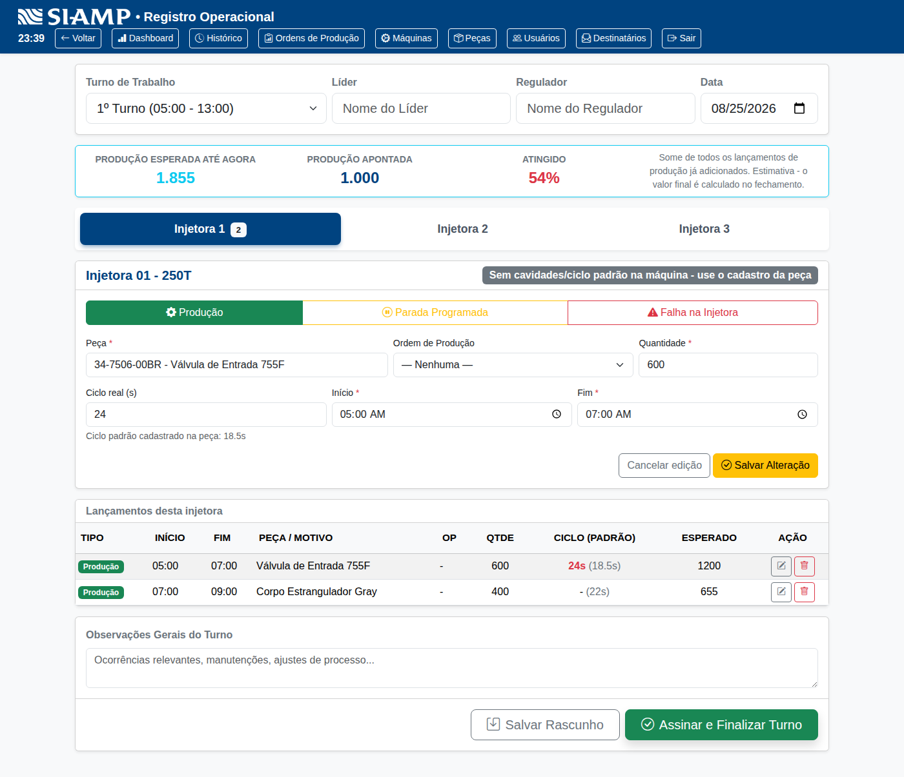</td>
<td>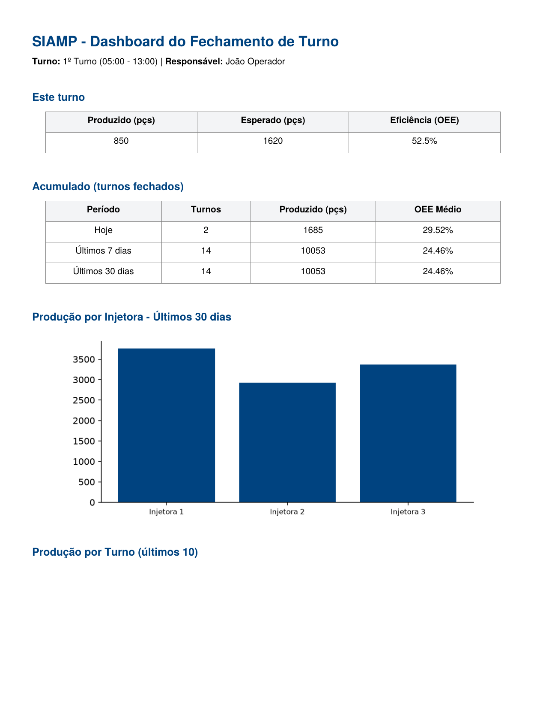</td>
</tr>
<tr>
<td align="center"><sub>Editar um lançamento já adicionado (sem apagar e relançar)</sub></td>
<td align="center"><sub>PDF do dashboard anexado ao e-mail de fechamento, com gráficos de verdade</sub></td>
</tr>
</table>

## 🚀 Funcionalidades Principais

- **Autenticação por usuário:** login com e-mail/senha, sessão via cookie `httpOnly` (não exposto ao JavaScript) — sem cadastro público, contas são criadas por um administrador.
- **Controle de acesso por perfil:** `ADMIN`, `SUPERVISOR` e `OPERADOR`, com permissões diferentes em cada tela (ver tabela abaixo). O frontend esconde o que o perfil não pode usar, mas a permissão de verdade é sempre revalidada pelo backend em cada endpoint.
- **Hub de navegação:** depois do login, a tela **Início** reúne um card de acesso rápido para cada tela do sistema, já filtrados pelo perfil de quem está logado.
- **Apontamento por lançamento livre:** em vez de uma grade fixa por hora, cada apontamento é um lançamento com horário de início/fim livre dentro do turno — produção (peça, Ordem de Produção, quantidade) ou parada (programada ou falha na injetora), quantos forem necessários por injetora. O cálculo de produção esperada usa a duração real de cada lançamento (`3600/ciclo × cavidades`), não mais uma hora cheia fixa — funciona nativamente com turnos que cruzam a meia-noite (ex.: 3º turno, 22h–05h). Cada lançamento pode ser **editado depois de adicionado** (corrige erro de digitação sem precisar apagar e relançar do zero). *Turnos criados antes dessa mudança continuam no modelo antigo (por hora), preservados para consulta e correção.*
- **Ciclo real informado x padrão da peça:** opcionalmente, o operador digita o ciclo real observado na injetora durante o lançamento — a tela mostra os dois valores lado a lado e destaca em vermelho quando divergem, ajudando a identificar rápido quando o molde está regulado diferente do cadastrado. O ciclo informado tem prioridade no cálculo de produção esperada.
- **Salvar o progresso do turno (rascunho):** o responsável não precisa mais esperar o fim do turno para conferir os números — dá para salvar o que já foi apontado a qualquer momento (sem disparar PDF/e-mail), continuar depois de fechar o navegador, e só finalizar de verdade quando o turno realmente encerrar.
- **Injetoras e Peças configuráveis:** administradores e supervisores cadastram/editam máquinas e o catálogo de peças (código, ciclo médio, cavidades — obrigatórios e editáveis) pela própria interface — nada fixo no código. Peças têm um campo de busca por código/descrição, pensado para catálogos grandes.
- **Ordens de Produção:** cadastro manual ou **importação em lote via CSV/XML** — peça e máquina são resolvidas pelo código já cadastrado, linhas com código desconhecido são rejeitadas e listadas (sem travar a importação das demais). Comparativo automático de meta x produção real, correto mesmo quando a mesma OP é produzida em mais de uma injetora ao mesmo tempo.
- **Gestão de usuários:** administradores cadastram novos usuários (operador, supervisor ou admin) e ativam/desativam contas.
- **Destinatários de relatório configuráveis:** quem recebe o e-mail de fechamento de turno é cadastrado pela tela **Destinatários** (ADMIN) — não depende mais de editar variável de ambiente e reiniciar o servidor.
- **Fechamento de turno com cálculo automático de OEE:** índice de produção e qualidade combinados automaticamente; parada programada (troca de molde, manutenção preventiva etc.) não penaliza o cálculo — só o que efetivamente parou a linha sem planejamento conta contra a eficiência.
- **Histórico de Turnos:** listagem dos turnos encerrados (e dos rascunhos em andamento, com indicação clara de status) com produção total, eficiência e status; download do relatório em PDF a qualquer momento, reenvio por e-mail sob demanda, e **exportação em CSV** (uma linha por lançamento/hora apontada) para análise em Excel ou Power BI.
- **Relatórios em PDF sob demanda:** detalhados por lançamento/máquina, com a peça e a Ordem de Produção atendidas em cada linha — gerados a partir dos dados reais do turno, não dependem de e-mail configurado para existir.
- **Envio automático de relatório por e-mail:** ao fechar um turno, **dois PDFs** são enviados em background para os destinatários cadastrados — o relatório de fechamento (detalhado por lançamento) e um dashboard com o desempenho do turno comparado ao acumulado diário/semanal/mensal, com os mesmos gráficos (barras, linha) disponíveis na tela do Dashboard, não só tabelas de números. Funciona via SMTP (bom para desenvolvimento local) ou via API HTTP do Brevo (necessário em hospedagens que bloqueiam portas SMTP no plano gratuito, como o Render — ver `DEPLOY.md`). Validado em produção via ambos os caminhos.
- **Dashboard Analítico:** OEE médio, produção acumulada por injetora, produção e OEE dos últimos turnos, comparativo de meta x real das Ordens de Produção mais recentes, e um card de **Risco de Próxima Parada** — modelo de Machine Learning (Random Forest, scikit-learn) que estima a probabilidade de a *próxima* produção de uma injetora resultar em parada não programada, combinando o histórico de falha da máquina e da peça com a divergência entre o ciclo real informado e o padrão cadastrado. Diferente de um resumo do que já aconteceu, é uma previsão prospectiva — explica os sinais que levaram ao diagnóstico, e deixa claro quando está usando o modelo treinado ou uma heurística de fallback (enquanto não há modelo treinado disponível). Os números acumulados (produzido, OEE médio, produção por injetora) podem ser filtrados por período — **Hoje / Últimos 7 dias / Últimos 30 dias / Total** — enquanto a tendência por turno e o comparativo de OPs continuam sempre mostrando os mais recentes.
- **Fuso horário de Brasília:** toda data/hora gravada (fechamento de turno, cadastros) usa o horário de Brasília de forma explícita, independentemente do fuso do servidor onde o sistema está hospedado (bancos gerenciados na nuvem costumam rodar em UTC por padrão).
- **Identidade visual da SIAMP:** cores e logo da marca aplicadas em todo o sistema.
- **Pronto para deploy:** guia completo de publicação no Render (hospedagem) com Supabase (banco Postgres) em `DEPLOY.md`.

## 🛠️ Tecnologias

- **Backend:** Python 3.12 + FastAPI, SQLAlchemy, Alembic
- **Frontend:** HTML5/CSS3/JavaScript + Bootstrap (páginas estáticas, servidas via Nginx)
- **Banco de Dados:** PostgreSQL (Supabase em produção)
- **Relatórios:** ReportLab (PDF)
- **Autenticação:** JWT em cookie `httpOnly` (`python-jose` + `passlib`/`bcrypt`), login em `/api/v1/auth/login`
- **E-mail:** SMTP padrão ou API HTTP do Brevo (`requests`)
- **Importação de arquivos:** CSV nativo do Python; XML via `defusedxml` (proteção contra XXE em arquivos enviados por usuário)
- **IA / Analytics:** scikit-learn — Random Forest treinado para prever risco de parada não programada (não uma reafirmação de regra sobre dado já observado); pipeline de treino em `data_science/`, com gerador de dados sintéticos para bootstrapping quando o volume real de produção ainda é pequeno

## 🏁 Como Executar o Projeto

> Quer publicar numa URL pública em vez de rodar só localmente? Veja
> **[DEPLOY.md](DEPLOY.md)** para o passo a passo de deploy no Render
> com banco Supabase.

```bash
# 1. Clone o repositório
git clone https://github.com/alexnascimento1980/siamp.git
cd siamp

# 2. Configurar variáveis de ambiente
cp .env.example .env
# Edite o .env e defina POSTGRES_PASSWORD e JWT_SECRET_KEY
# (gere uma chave forte com: python -c "import secrets; print(secrets.token_urlsafe(64))")

# 3. Execução via Docker Compose (Recomendado)
docker compose up --build
```

Ao subir, o backend aplica automaticamente as migrations do Alembic e,
se `SEED_ON_START=true` (padrão no `.env.example`), carrega os dados
de exemplo em `database/seeds.sql`.

- API: http://localhost:8000 (docs interativos em `/docs`)
- Frontend: http://localhost:8090 (abre direto na tela de login; depois de
  autenticar, cai no hub de navegação com acesso às demais telas)

> **Porta ocupada?** Se `8090` já estiver em uso na sua máquina, altere
> o mapeamento em `docker-compose.yml` (serviço `frontend`, chave
> `ports`) para outra porta livre, e atualize `CORS_ORIGINS` no `.env`
> para incluir a nova origem (ex. `http://localhost:8091`).

### Criando o primeiro usuário (administrador)

Não há endpoint público de cadastro (por design — criar contas é uma
operação sensível). Crie o primeiro usuário (admin) com o script
idempotente `create_admin` (pode rodar mais de uma vez sem risco —
se o e-mail já existir, ele só avisa e não faz nada):

```bash
docker compose exec backend_api python -m app.scripts.create_admin \
    --nome "Admin" \
    --email admin@empresa.com \
    --senha "troque-esta-senha"
```

A partir daí, faça login em `http://localhost:8090/login.html` e use a
tela **Usuários** (visível só para ADMIN) para cadastrar os demais
usuários da equipe — não é mais necessário repetir o comando acima.

> **Perdeu o usuário depois de reiniciar o projeto?** Os dados do
> Postgres ficam num volume Docker (`pgdata`) que sobrevive a
> `docker compose down` / `docker compose up` normalmente. Só
> `docker compose down -v` remove esse volume (e junto, todo o banco,
> inclusive os usuários) — use `-v` apenas quando quiser mesmo resetar
> o ambiente do zero.

### Envio de relatório por e-mail (opcional)

Ao fechar um turno, o SIAMP tenta enviar o PDF do relatório por e-mail
em background (não bloqueia o fechamento do turno em si). Isso só
acontece se houver um provedor configurado — `BREVO_API_KEY` **ou**
`SMTP_USER`/`SMTP_PASS` — e pelo menos um destinatário, seja pela tela
**Destinatários** ou pela variável `REPORT_RECIPIENTS` no `.env`. Sem
isso, o envio é simplesmente pulado (não é erro). O caminho SMTP fala
o protocolo padrão (STARTTLS na porta 587), então funciona com
qualquer provedor — trocar de provedor é só trocar estas variáveis,
sem mexer em nada mais:

```env
SMTP_SERVER=<host do provedor>
SMTP_PORT=587
SMTP_USER=<usuário/token do provedor>
SMTP_PASS=<senha/token do provedor>
SMTP_FROM=<endereço remetente validado no provedor - opcional>
REPORT_RECIPIENTS=gerente.producao@empresa.com,supervisao@empresa.com
```

> **`SMTP_USER` e `SMTP_FROM` não são sempre o mesmo endereço.** Em
> provedores transacionais (Brevo, SendGrid etc.), o `SMTP_USER` é só
> um token técnico de autenticação — usar esse mesmo valor como
> remetente (`From:`) é rejeitado com um erro do tipo *"Sending has
> been rejected because the sender you used is not valid"*. Nesses
> casos, valide um endereço remetente no painel do provedor (no Brevo:
> *Settings → Senders, Domains & Dedicated IPs → Senders → Add a
> Sender*, confirmando pelo e-mail que chega) e configure-o em
> `SMTP_FROM`. Sem `SMTP_FROM` definida, o sistema usa o mesmo valor de
> `SMTP_USER` (o caso comum do Gmail, onde os dois coincidem).

Depois de editar o `.env`, é preciso **recriar** o container do backend
para ele reler as variáveis (`docker compose up -d` sozinho às vezes
reaproveita o container já rodando e ignora o `.env` novo):

```bash
docker compose up -d --force-recreate backend_api
```

E validar sem precisar fechar um turno de verdade:

```bash
docker compose exec backend_api python -m app.scripts.testar_email --para seu-email@empresa.com
```

Se der erro, o script já indica a causa mais provável — os mesmos
detalhes também ficam registrados no log do container
(`docker compose logs backend_api`) sempre que um envio de relatório
real falhar.

#### Escolhendo um provedor SMTP

| Provedor | Free tier | Observações |
|---|---|---|
| **[Brevo](https://www.brevo.com)** (ex-Sendinblue) | 300 e-mails/dia, pra sempre | Recomendado para produção — tem **API HTTP** além de SMTP (`BREVO_API_KEY`), essencial em hospedagens que bloqueiam portas SMTP no plano gratuito (ex.: Render). Validado em produção no SIAMP, via API |
| **Gmail** | Grátis, mas é uma conta pessoal | Único dos grandes provedores que ainda aceita [senha de app](https://myaccount.google.com/apppasswords) + SMTP simples em 2026 (Microsoft aposentou isso para contas Outlook/Hotmail pessoais). Validado em desenvolvimento local no SIAMP — mas **não funciona em hospedagens que bloqueiam portas SMTP de saída** (ex.: Render gratuito), já que só oferece SMTP, sem API HTTP alternativa |
| **[Resend](https://resend.com)** | 100/dia, 3.000/mês | Setup rápido, pensado para desenvolvedores, também tem API HTTP |
| **[SendGrid](https://sendgrid.com)** | 100/dia | Exige verificação de remetente, também tem API HTTP |
| **[Mailtrap](https://mailtrap.io) (Sandbox)** | Ilimitado, mas **não entrega e-mail real** | Só para testar em desenvolvimento — os e-mails ficam presos numa caixa de teste no próprio site do Mailtrap. Use o produto "Email Sending" (separado do Sandbox) se quiser entrega real pelo Mailtrap |
| **Amazon SES** | Barato após o free tier | Exige sair do "sandbox mode" da AWS antes de enviar para destinatários não verificados — mais burocrático |

**Resumo prático:** para **desenvolvimento local**, o Gmail é o caminho
com menos fricção (você já tem a conta, só precisa gerar uma senha de
app). Para **produção numa hospedagem com plano gratuito** (Render,
por exemplo), use o **Brevo com `BREVO_API_KEY`** — é o único caminho
testado neste projeto que funciona nesse cenário, já que fala HTTPS em
vez de SMTP (ver aviso mais abaixo e `DEPLOY.md`).

**Exemplo com Brevo (SMTP):** painel → *Settings* → *SMTP & API* → aba
*SMTP* → gerar uma "SMTP key". O host é `smtp-relay.brevo.com`, porta
`587`, usuário é o e-mail de cadastro, senha é a chave SMTP gerada.
Para a API (recomendado em produção), veja `BREVO_API_KEY` no
`.env.example` e a nota logo abaixo.

> **Hospedando em algo como o Render?** O plano gratuito do Render
> bloqueia portas SMTP de saída (25/465/587) desde set/2025. Nesse
> caso, use `BREVO_API_KEY` em vez de `SMTP_USER`/`SMTP_PASS` - o
> sistema passa a falar com o Brevo via API HTTPS (não afetada por
> esse bloqueio) em vez de SMTP. Validado em produção no Render. Ver
> `DEPLOY.md`.

**Erro `535 Bad Credentials` com Gmail:** normalmente é uma destas
causas, na ordem mais provável:
1. `SMTP_PASS` é a senha normal da conta, não uma senha de app
2. Aspas sobrando na senha dentro do `.env` (não usar aspas: `SMTP_PASS=abc123`, não `SMTP_PASS="abc123"`)
3. Senha de app gerada numa conta Google diferente da configurada em `SMTP_USER`
4. Conta com "[Navegação Segura Avançada](https://myaccount.google.com/advanced-protection)" ativada, que bloqueia senha de app

### Perfis de usuário

| Perfil       | Apontamento / Histórico / Dashboard / Ordens de Produção (visualizar) | Cadastrar Máquinas / Peças / Ordens de Produção | Usuários / Destinatários |
| ------------ | ----------------------------------------------------------------------- | ------------------------------------------------ | ------------------------- |
| `OPERADOR`   | ✅                                                                        | ❌                                                 | ❌                         |
| `SUPERVISOR` | ✅                                                                        | ✅                                                 | ❌                         |
| `ADMIN`      | ✅                                                                        | ✅                                                 | ✅                         |

O frontend esconde os links conforme o perfil, mas a permissão de
verdade é sempre revalidada pelo backend em cada endpoint.

### Cadastrando injetoras

O número de injetoras não é fixo: administradores e supervisores
cadastram novas máquinas na tela **Máquinas** (número e descrição).
Elas aparecem automaticamente como abas na tela de apontamento assim
que cadastradas.

### Cadastrando peças

O catálogo de peças (tela **Peças**) guarda código, descrição, ciclo
médio (segundos) e cavidades — **campos obrigatórios**, é a única
fonte usada no cálculo de OEE (a máquina não guarda mais esses
valores, evitando duas fontes de verdade divergentes). O apontamento
e o cadastro de Ordens de Produção só permitem selecionar peças já
cadastradas aqui, com um campo de busca por código/descrição para
catálogos grandes. Código, ciclo e cavidades continuam editáveis
depois do cadastro (ex.: corrigir um código digitado errado, ou
ajustar cavidades quando uma delas é fechada temporariamente).

### Ordens de Produção

Cadastradas manualmente (tela **Ordens de Produção**) a partir do
documento emitido pelo ERP da empresa, ou **importadas em lote via
CSV/XML** — colunas obrigatórias `numero_op`, `produto_codigo`,
`numero_maquina`, `quantidade_a_produzir`, `periodo_inicio`,
`periodo_fim` (datas em `AAAA-MM-DD` ou `DD/MM/AAAA`). Peça e máquina
são resolvidas pelo código já cadastrado — uma linha com código
desconhecido é rejeitada e reportada (com a lista do que falta
cadastrar), sem travar a importação das demais linhas válidas do
mesmo arquivo.

O comparativo de meta x produção real soma o que foi apontado nos
turnos **diretamente vinculado àquela OP** (não por aproximação de
máquina + data), então funciona corretamente mesmo quando a mesma OP
é produzida em duas injetoras ao mesmo tempo. O relatório de turno em
PDF também mostra qual OP foi atendida em cada lançamento.

### Salvando o progresso do turno (rascunho)

O apontamento não precisa ser preenchido de uma vez só: o botão
**Salvar Rascunho** grava o que já foi lançado, sem disparar PDF nem
e-mail — dá para fechar o navegador e continuar depois de onde parou.
Só o botão **Assinar e Finalizar Turno** fecha de verdade e aciona o
envio. Rascunhos em andamento aparecem no Histórico com status
diferenciado, e não entram nas métricas do Dashboard até serem
efetivamente fechados (evita números incompletos/instáveis
aparecendo como se fossem definitivos).

### Exportando dados para Excel / Power BI

A tela **Histórico** tem um botão de exportar em CSV (com filtro de
período opcional) — uma linha por lançamento/hora apontada, cobrindo
turnos dos dois modelos (por hora e por lançamento) no mesmo arquivo.
Usa `;` como separador (padrão do Excel em português) e é aberto
diretamente com duplo clique, sem precisar importar manualmente.

### Destinatários do relatório de e-mail

A lista de quem recebe o PDF de fechamento de turno por e-mail é
gerenciada pela tela **Destinatários** (ADMIN) — não é mais necessário
editar `REPORT_RECIPIENTS` no `.env` e reiniciar o servidor toda vez
que alguém entra ou sai da lista. Sem nenhum destinatário cadastrado
ali, o sistema usa `REPORT_RECIPIENTS` do `.env` como reserva.

### Rodando os testes

```bash
cd backend
pip install -r requirements-dev.txt
pytest -v
```

Deve dar **124 testes passando**.
